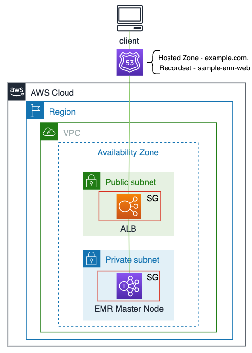
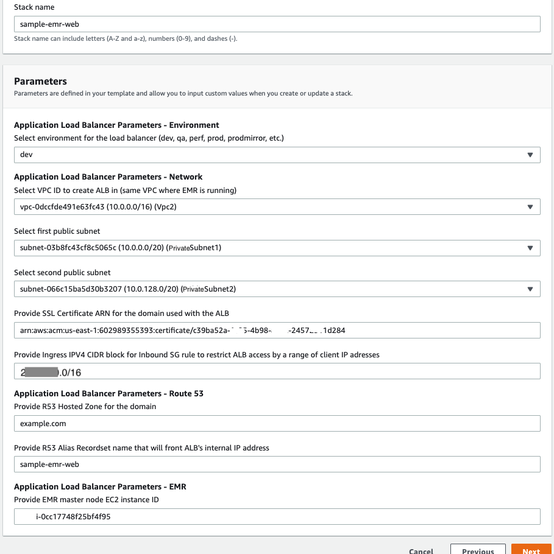
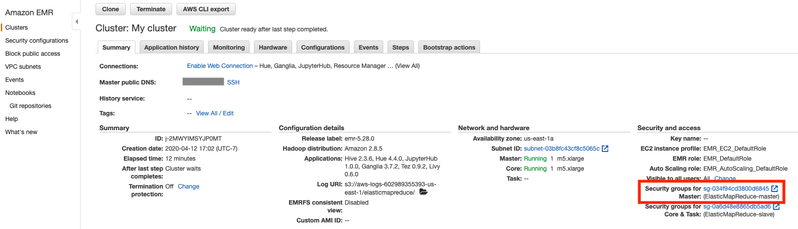
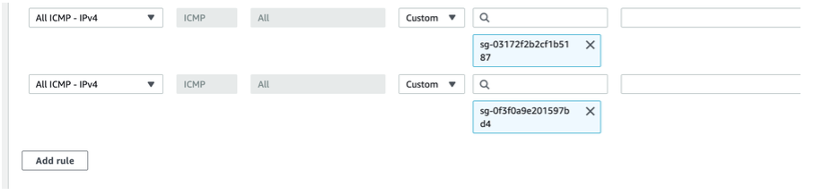
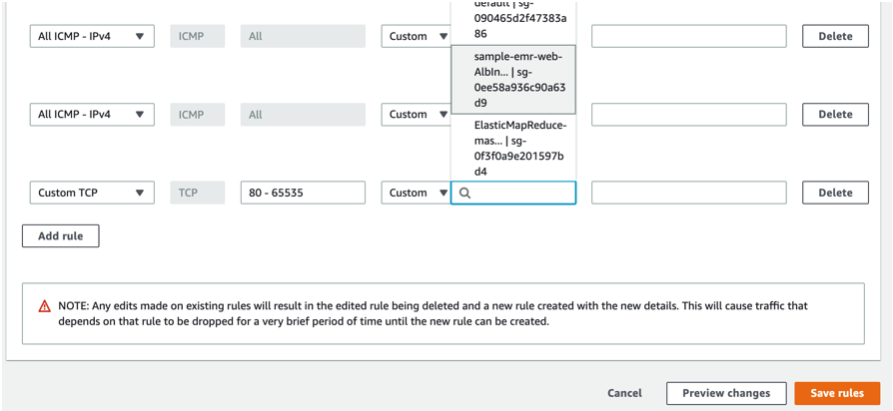
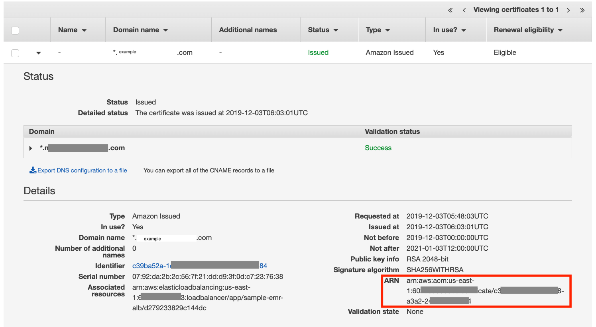
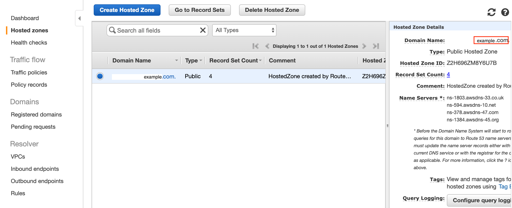
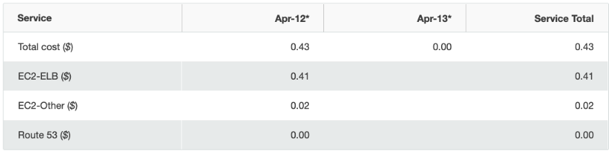

## Securely Access Web Interfaces on Amazon EMR Launched in a Private Subnet using an Application Load Balancer

EMR web interfaces are hosted on the master node of an EMR cluster. When you launch an Amazon EMR cluster in a private subnet, the EMR master node doesn’t have a public DNS record. The web interfaces for the EMR hosted in a private subnet are not easily accessible outside the subnet. An Application Load Balancer (ALB), launched in a public subnet, can be used as a HTTP proxy to access EMR web interfaces over the internet without requiring SSH tunneling through a bastion host. This approach greatly simplifies accessing EMR web interfaces for data scientists and data engineers.

This post outlines the solution using an ALB to securely access EMR web interfaces over the internet for an EMR cluster launched in a private subnet.

|                             |                           |
|-----------------------------|---------------------------|
|Time to read	                | 5 minutes                 |
|Time to complete             | 30 minutes                |
|Cost to complete (estimated) |	$.50                      |
|Learning level               |	Advanced (300)            |
|Services used                | Application Load Balancer |
|                             |  Route 53                 |
|                             |   Amazon EMR              |
|                             |   AWS Certificate Manager |

## Overview of solution
Nodes that are launched within a VPC subnet cannot communicate outside of the subnet, unless there is a network route from the subnet to other subnets in its VPC, or subnets in other VPCs using VPC Pairing, or having a route through AWS Direct Connect to the subnet, or having a route to an internet gateway, or having a route to the subnet from a VPN connection. For customers who want the highest level of security to an EMR cluster, they choose to place the cluster into a subnet with minimal number of routes to the cluster. This makes it more difficult to access web interfaces running on the master node of an EMR cluster that is launched in a private subnet. In this solution, we use an ALB hosted in a public subnet that acts as an HTTP proxy to web interface endpoints on the EMR master node. The ALB listens on HTTP(s) ports for incoming web interface access requests; and route requests to the configured ALB targets those point to the web interface endpoints on the EMR master node.

The diagram below shows the network flow from the client to the EMR master node through Route 53 and ALB to access the web interfaces running on the EMR master node in a private subnet.

## Securing your Endpoints
The solution outlined in this post restricts access to EMR web interfaces for a range of client IP addresses using an ingress security group on ALB. The endpoints that are reachable using ALB should be further secured by having a user authentication mechanism like LDAP, SSO, etc. Jupyter authentication methods are found at - [Adding Jupyter Notebook Users and Administrators](https://docs.aws.amazon.com/emr/latest/ReleaseGuide/emr-jupyterhub-user-access.html), Hue is found at: [Configure Hue for LDAP Users](https://docs.aws.amazon.com/emr/latest/ReleaseGuide/hue-ldap.html), Hive is found at - [LDAP Authentication for Hive](https://cwiki.apache.org/confluence/display/Hive/User+and+Group+Filter+Support+with+LDAP+Atn+Provider+in+HiveServer2). Additionally, it may be a good idea to enable access logs through the ALB. Please refer to ‘[Access Logs for Application Load Balancer](https://docs.aws.amazon.com/elasticloadbalancing/latest/application/load-balancer-access-logs.html)’ for more details on ALB access logs.

Please see below the sequence of steps executed when the EMR web instance is accessed by a client through Route 53 and ALB.

  * •	Client submits web interface request from a web browser, e.g. YARN Node Manager - http://sample-emr-web.example.com:8088/cluster
  *	•	The HTTP request will be resolved by Route 53 using the record set name “sample-emr-web” in the hosted zone “example.com.” for the registered domain “example.com”. Route 53 will resolve the request URL to the IP address of ALB in the public subnet, and route request to the ALB.
  *	The ALB receives the EMR web interface request on its HTTP listener and forwards it to the web interface endpoint configured in the load balancer target group. There are multiple HTTP listener and load balancer target group pairs created, one for each EMR web interface endpoint.
  *	The ALB Ingress Security Group controls what other VPCs and/or corporate networks can access the ALB
  *	The EMR Ingress Security Group on the master node allows inbound traffic from the ALB to the EMR

The CloudFormation template for this solution creates the following AWS objects in the solution stack:
  *	ALB
  *	HTTP Listener and target pairs - one pair for each EMR web application. It supports Ganglia, YARN Resource Manager, JupyterHub, Livy and Hue EMR web applications. You can modify the CloudFormation stack to add ALB HTTP listeners and targets for any other EMR web applications. The CloudFormation code snippet below shows the code for ALB, HTTP Listener, and load balancer target.
  *	AWS::Route53::RecordSet object in the hosted zone for a given registered domain, e.g. record set name - ‘sample-emr-web’ for the hosted zone – ‘example.com.’ for the domain ‘example.com’. The hosted-zone and record set name are parameters on the CloudFormation template.
  *	An Ingress Security Group attached to the ALB that controls what CIDR blocks can access the ALB. You can modify the template to customize Ingress SG to meet your requirements.

## Prerequisites
For this walkthrough, you should have the following prerequisites:
  *	An [AWS account](https://signin.aws.amazon.com/signin?redirect_uri=https%3A%2F%2Fportal.aws.amazon.com%2Fbilling%2Fsignup%2Fresume&client_id=signup)
  *	VPC with private and public subnets. ALB requires at least two availability zones (AZ), with one public subnet in each AZ. Please refer to [basic-vpc-example](https://github.com/kennyk65/aws-vpc-cloud-formation/blob/master/base-vpc-example.template.yml) for sample code to create a basic VPC with private and public subnets.
  *	EMR instance launched in a private subnet
  *	Web applications - Ganglia, Livy, Jupyter and Hue should be installed on the EMR cluster when the cluster is launched
  *	Create a Hosted Zone entry in Route 53 for your domain

  Note: You will need to register a new domain, if you don’t have a domain. You can register a new domain in Route 53. There is a non-refundable cost associated with registering a new domain. Please review [Amazon Route 53 Pricing for Domain Registration](https://aws.amazon.com/route53/pricing/).

  *	A public certificate is required to access HTTPS endpoints in the domain. If you don’t have a public certificate, please create a new certificate. Please refer to [Requesting a Public Certificate](https://docs.aws.amazon.com/acm/latest/userguide/gs-acm-request-public.html).

To create ALB as an HTTP proxy in front of EMR, please follow the steps below to create CloudFormation stack.
  1.	Log in to [AWS account](https://signin.aws.amazon.com/signin?redirect_uri=https%3A%2F%2Fportal.aws.amazon.com%2Fbilling%2Fsignup%2Fresume&client_id=signup)
  2.	Select CloudFormation from services menu
  3.	Select ‘Create Stack’ action from ‘Action’ menu
  4.	Select the CloudFormation template file you downloaded
  5.	Enter parameter values, and follow screen prompts to create stack.

  The following screenshot shows example for stack parameters:
  

  6.	Modify EMR Master Node Security Group to allow ingress traffic from the ALB. Create ‘Custom TCP’ rule with port range – 80-65535, and add source SG that is attached with the ALB. Please follow the steps listed below to add inbound rule to the security group.

  Select EMR Master Node Security Group:

  Click on the ‘Security group for master’ on EMR cluster summary tab to navigate to the security group.
  

  Add New Inbound Rule to the security group:

  Click ‘Edit inbound rules’ to view security group edit screen.
  

  Click ‘Add rule’ button.
  

  Add port range and select ALB Security Group as a source security group as shown below. Click ‘Save rules’ button to save the change.
  

  7.	Test EMR Web Interfaces in Browser
    a.	Ganglia Web URL- http://sample-emr-web.[web domain]/ganglia/
    b.	YARN Resource Manager- http://sample-emr-web.[web domain]:8088/cluster
    c.	JupyterHub- https://sample-emr-web.[web domain]:9443/hub/login
    d.	Hue- http://sample-emr-web.[web domain]:8888/hue/accounts/login
    e.	Livy- http://sample-emr-web.[web domain]:8998/ui

    Note: If you can access Ganglia web interface on port 80, but don’t get response from other endpoints listening on other ports, disconnect from your VPN connection and test. Some organizations may block outgoing web requests on ports other than 80.

    Sometimes Route 53 DNS record updates propagation to world-wide network of DNS servers may take longer than it takes under normal conditions. If you don’t get response from web interfaces, please wait to test for a minute or two after the CloudFormation stack is created.

    Note: You can add code to support other EMR Web Interface endpoints in the CloudFormation template. You can find full list of EMR Web Interfaces [here](https://docs.aws.amazon.com/emr/latest/ManagementGuide/emr-web-interfaces.html).

  How to get Public Certificate ARN from Certificate Manager:
  Open Certificate Manager service in AWS console. Expand the domain for the certificate, and copy certificate ARN in your clipboard.
  

  How to get Hosted Zone from Route 53:
  Open Route 53 service in AWS console. Select the ‘Hosted Zones’ menu option on the left navigation menu, select the hosted zone for your domain. Copy domain name without the ‘.’ at the end of the string and paste it in the ‘R53 Hosted Zone’ CloudFormation parameter box.
  

Cost breakup:
The cost explorer table below shows sample total cost and cost breakup by services for the time it takes to complete exercise in this blog. This cost includes cost for a minimal EMR cluster without any data stored created at the start of the exercise, and the resources created by the CloudFormation template.

## Cleaning up
To avoid incurring future charges, delete CloudFormation stack to delete all the resources created.

## Conclusion
You can now create an Application Load Balance as a HTTP proxy to access EMR web interfaces securely over the internet, without requiring bastion host for SSH tunneling. This simplifies securely accessing EMR web interfaces for the EMR launched in a private subnet.

## License

This library is licensed under the MIT-0 License. See the LICENSE file.
