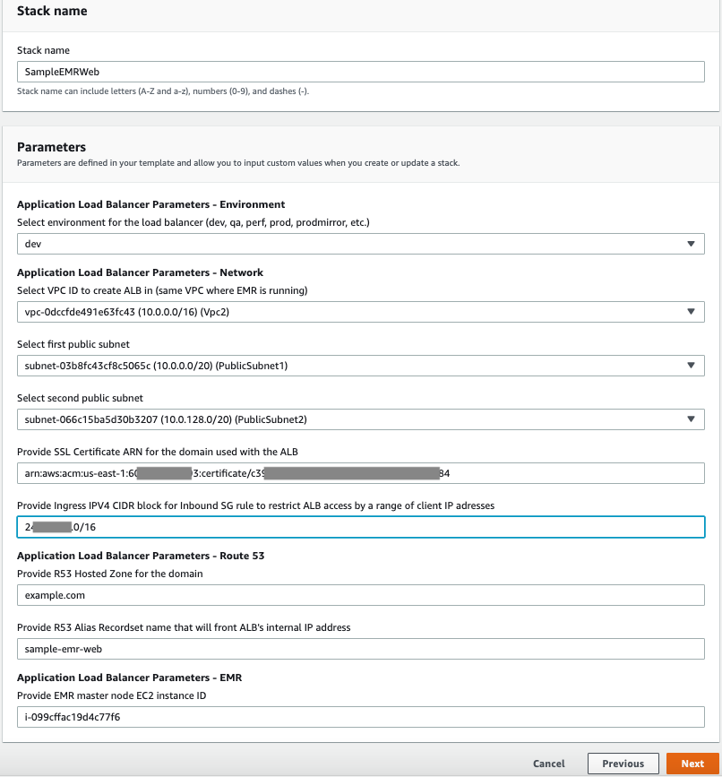

## Accessing web interfaces securely on Amazon EMR launched in a private subnet using an Application Load Balancer

Amazon EMR web interfaces are hosted on the master node of an EMR cluster. When you launch an EMR cluster in a private subnet, the EMR master node doesn’t have a public DNS record. The web interfaces hosted in a private subnet aren’t easily accessible outside the subnet. You can use an Application Load Balancer (ALB), launched in a public subnet, as an HTTP proxy to access EMR web interfaces over the internet without requiring SSH tunneling through a bastion host. This approach greatly simplifies accessing EMR web interfaces.

This post outlines how to use an ALB to securely access EMR web interfaces over the internet for an EMR cluster launched in a private subnet.

|                             |                           |
|-----------------------------|---------------------------|
|Time to read	                | 5 minutes                 |
|Time to complete             | 30 minutes                |
|Cost to complete (estimated) |	$0.50                     |
|Learning level               |	Advanced (300)            |
|Services used                | Application Load Balancer |
|                             | Route 53                  |
|                             | Amazon EMR                |
|                             | AWS Certificate Manager   |

## Overview of solution
Nodes that are launched within a VPC subnet can’t communicate outside of the subnet unless one of the following exists:

* A network route from the subnet to other subnets in its VPC
* Subnets in other VPCs using VPC Peering
* A route through AWS Direct Connect to the subnet
* A route to an internet gateway
* A route to the subnet from a VPN connection

If you want the highest level of security to an EMR cluster, you should place the cluster in a subnet with a minimal number of routes to the cluster. This makes it more difficult to access web interfaces running on the master node of an EMR cluster launched in a private subnet. 

This solution uses an ALB hosted in a public subnet that acts as an HTTP proxy to web interface endpoints on the EMR master node. The ALB listens on HTTP(s) ports for incoming web interface access requests and routes requests to the configured ALB targets that point to the web interface endpoints on the EMR master node.

The following diagram shows the network flow from the client to the EMR master node through Amazon Route 53 and ALB to access the web interfaces running on the EMR master node in a private subnet.

## Securing your endpoints
The solution outlined in this post restricts access to EMR web interfaces for a range of client IP addresses using an ingress security group on ALB. You should further secure the endpoints that are reachable using ALB by having a user authentication mechanism like LDAP or SSO. For more information about Jupyter authentication methods, see [Adding Jupyter Notebook Users and Administrators](https://docs.aws.amazon.com/emr/latest/ReleaseGuide/emr-jupyterhub-user-access.html). For more information about Hue, see [Configure Hue for LDAP Users](https://docs.aws.amazon.com/emr/latest/ReleaseGuide/hue-ldap.html). For more information about Hive, see [User and Group Filter Support with LDAP Atn Provider in HiveServer2](https://cwiki.apache.org/confluence/display/Hive/User+and+Group+Filter+Support+with+LDAP+Atn+Provider+in+HiveServer2). Additionally, it may be a good idea to enable access logs through the ALB. For more information about ALB access logs, see ‘[Access Logs for Application Load Balancer](https://docs.aws.amazon.com/elasticloadbalancing/latest/application/load-balancer-access-logs.html)’ for more details on ALB access logs.

## Solution walkthrough
When a client accesses an EMR web interface, the process includes the following sequence of steps:

  *	A client submits an EMR web interface request from a web browser (for example, [YARN Node Manager](http://sample-emr-web.example.com:8088/cluster)).
  *	Route 53 resolves the HTTP request using the record set name sample-emr-web in the hosted zone example.com for the registered domain example.com. Route 53 resolves the request URL to the IP address of the ALB launched in a public subnet, and routes the request to the ALB.
  *	The ALB receives the EMR web interface request on its HTTP listener and forwards it to the web interface endpoint configured in the load balancer target group. There are multiple HTTP listener and load balancer target group pairs created, one pair for each EMR web interface endpoint.
  *	The ALB ingress security group controls what other VPCs or corporate networks can access the ALB. 
  *	The EMR ingress security group on the master node allows inbound traffic from the ALB to the EMR master node.

The AWS CloudFormation template for this solution creates the following AWS objects in the solution stack:

  *	An ALB.
  * HTTP listener and target pairs; one pair for each EMR web application. It supports Ganglia, YARN Resource Manager, JupyterHub, Livy, and Hue EMR web applications. You can modify the CloudFormation stack to add ALB HTTP listeners and targets for any other EMR web applications. The following AWS CloudFormation code example shows the code for the ALB, HTTP listener, and load balancer target:
  * The AWS::Route53::RecordSet object (sample-emr-web) in the hosted zone (example.com) for a given registered domain (example.com). The hosted zone and record set name are parameters on the CloudFormation template.
  * An Ingress Security Group attached to the ALB that controls what CIDR blocks can access the ALB. You can modify the template to customize the security group to meet your requirements.

## Prerequisites
To follow along with this walkthrough, you need the following:

  * An [AWS account](https://signin.aws.amazon.com/signin?redirect_uri=https%3A%2F%2Fportal.aws.amazon.com%2Fbilling%2Fsignup%2Fresume&client_id=signup)
  * A VPC with private and public subnets. An ALB requires at least two Availability Zones, with one public subnet in each Availability Zone. For the sample code to create a basic VPC with private and public subnets, see the [GitHub repo]([basic-vpc-example](https://github.com/kennyk65/aws-vpc-cloud-formation/blob/master/base-vpc-example.template.yml)).
  * An EMR cluster launched in a private subnet.
  * Web applications such as Ganglia, Livy, Jupyter, and Hue installed on the EMR cluster when the cluster is launched.
  * A hosted zone entry in Route 53 for your domain. If you don’t have a domain, you can register a new one in Route 53. There is a non-refundable cost associated with registering a new domain. For more information, see [Amazon Route 53 Pricing](https://aws.amazon.com/route53/pricing/).
  * A public certificate to access HTTPS endpoints in the domain. You can [request a public certificate](https://docs.aws.amazon.com/acm/latest/userguide/gs-acm-request-public.html) if you don’t have one.

## Creating an ALB as an HTTP proxy
To create an ALB as an HTTP proxy in front of an EMR cluster, you first launch the CloudFormation stack. 

  1.	Log in to your AWS account.
  2.	Select the Region where you’re running your EMR cluster.
  3.	To launch your CloudFormation stack, choose Launch Stack.
  4.	Enter your parameter values and follow the screen prompts to create the stack.

The following screenshot shows examples of stack parameters.
  

  5.	Modify the EMR master node security group to allow ingress traffic from the ALB. 
  6.	Create a Custom TCP rule with port range 80–65535.
  7.	Add a source security group that is attached with the ALB. 

In the following steps, you add an inbound rule to the security group.

  8.	Choose the EMR master node security group.
  9.	Choose Security group for master on the EMR cluster Summary tab to open the security group.
  

  10.	Choose Edit inbound rules. 
  

  11.	Choose Add Rule.
  

  12.	Add a port range and select the ALB security group as a source security group.
  13.	Choose Save rules. 
  

  14.	Test the following EMR web interfaces in your browser:
      a.	Ganglia – http://sample-emr-web.[web domain]/ganglia/
      b.	YARN Resource Manager – http://sample-emr-web. [web domain]:8088/cluster
      c.	JupyterHub – https://sample-emr-web. [web domain]:9443/hub/login
      d.	Hue – http://sample-emr-web. [web domain]:8888/hue/accounts/login
      e.	Livy – http://sample-emr-web. [web domain]:8998/ui

  If you can access the Ganglia web interface on port 80 but don’t get a response from other web interface endpoints listening on other ports, disconnect from your VPN connection and test it. Some organizations may block outgoing web requests on ports other than 80.

  Sometimes Route 53 DNS record updates propagation to the worldwide network of DNS servers may take longer than it takes under normal conditions. If you don’t get a response from the EMR web interfaces, wait to test for a minute or two after the CloudFormation stack is created.

  You can add code to support other EMR web interface endpoints in the CloudFormation template. For more information, see View Web Interfaces Hosted on Amazon EMR Clusters.

  Locating the public certificate ARN from AWS Certificate Manager
  You can find the public certificate ARN from AWS Certificate Manager (ACM) on the ACM console. When you expand the domain for a given certificate, locate the ARN in the Details section. 
  

 Creating a hosted zone from Route 53
 To create a hosted zone from Route 53, complete the following steps: 

 1.	On the Route 53 console, choose Hosted zones.
 2.	Choose the hosted zone in your domain.
 3.	In the Hosted Zone Details section, copy the entry for Domain Name.
  

Cost breakup:
The cost explorer table below shows sample total cost and cost breakup by services for the time it takes to complete exercise in this blog. This cost includes cost for a minimal EMR cluster without any data stored created at the start of the exercise, and the resources created by the CloudFormation template.

 4.	Enter the domain name in the R53 Hosted Zone AWS CloudFormation parameter box.

## Cleaning up
To avoid incurring future charges, delete the CloudFormation stack to delete all the resources created

## Conclusion
You can now create an ALB as a HTTP proxy to access EMR web interfaces securely over the internet, without requiring a bastion host for SSH tunneling. This simplifies securely accessing EMR web interfaces for the EMR launched in a private subnet.

## License

This library is licensed under the MIT-0 License. See the LICENSE file.
